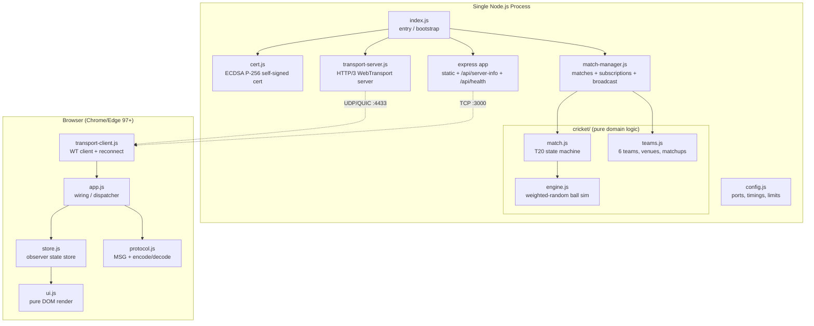
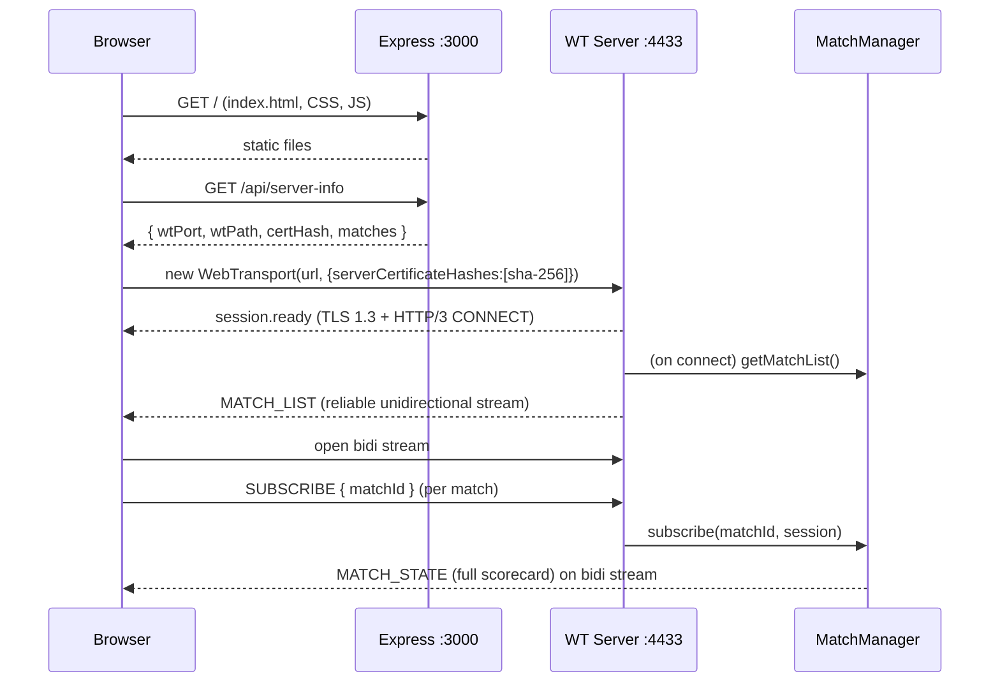
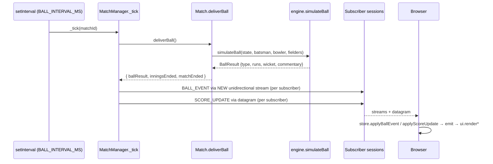

# Architecture

> Cricket Live Score Engine — a learning-grade but production-styled demo of
> **WebTransport (HTTP/3 + QUIC)** for real-time browser streaming.

## 1. System Overview

The system is a **single Node.js process** that:

1. Simulates up to 4 concurrent **T20 cricket matches**, advancing one ball every 4 seconds.
2. Serves a static browser dashboard over plain **HTTP (TCP :3000)** via Express.
3. Streams live match data to browsers over **WebTransport (UDP/QUIC :4433)**.

There is **no database, no message queue, no external API, no auth, and no
multi-process clustering**. All state lives in memory inside the `MatchManager`.
The "data" (teams, players, venues) is hard-coded in `server/cricket/teams.js`.

The browser is a **zero-dependency, no-framework** vanilla-JS app: a tiny
observer-pattern store, a WebTransport client with reconnect, and pure DOM
render functions.

### Why WebTransport (the whole point of the project)

The project deliberately exercises all three WebTransport channels to show when
each is appropriate:

| Channel | Direction | Carries | Reliability | Why this channel |
|---|---|---|---|---|
| **Datagrams** | Server → Client | `SCORE_UPDATE` | Unreliable, unordered | Cheap heartbeat; losing one is fine — another arrives in ~4s |
| **Unidirectional streams** | Server → Client | `BALL_EVENT`, `MATCH_STATUS`, on-connect `MATCH_LIST` | Reliable, ordered per stream | One stream per ball ⇒ no head-of-line blocking; bootstrap `MATCH_LIST` must be reliable |
| **Bidirectional stream** | Client ↔ Server | `SUBSCRIBE`/`UNSUBSCRIBE`/`GET_MATCHES` → `MATCH_STATE`/`ERROR` | Reliable, ordered | Request/reply command channel, one long-lived stream per session |

## 2. Technology Stack

| Layer | Technology | Notes |
|---|---|---|
| Runtime | Node.js ≥ 18 (devcontainer uses 22) | ESM (`"type": "module"`) |
| WebTransport server | `@fails-components/webtransport` + `...-transport-http3-quiche` | Loads a native C++ libquiche addon asynchronously (`quicheLoaded`) |
| HTTP server | `express` ^4 | Static files + 2 JSON endpoints |
| TLS cert | OpenSSL via `child_process.execSync` | ECDSA **P-256** self-signed, ≤14-day validity |
| IDs | `uuid` v4 | Match IDs |
| Wire format | JSON over UTF-8 (`TextEncoder`/`TextDecoder`) | `{ type, payload, ts }` envelope |
| Browser | Vanilla JS, no build step | 5 `<script>` tags in dependency order |
| Dev | `nodemon`, devcontainer (Debian + Node 22) | `selfsigned` is a listed dep but **unused** (RSA-only; replaced by OpenSSL) |

## 3. System Architecture Diagram

## 4. Request / Connection Lifecycle

### 4a. Page load + WebTransport handshake

### 4b. Ball delivery broadcast (every 4s per match)

## 5. Service Interactions & Boundaries

There is exactly one service (the process), but it has clear internal modules:

- **Transport boundary** (`transport-server.js`) — knows about WebTransport
  sessions, streams, datagrams. Talks to `MatchManager` only through
  `subscribe / unsubscribe / removeSession / getMatchList`.
- **Orchestration boundary** (`match-manager.js`) — owns the timer loop,
  subscriber registry, and all broadcast/encoding decisions. Knows about
  WebTransport session APIs (creates streams, gets datagram writers).
- **Domain boundary** (`cricket/`) — `Match` + `engine` + `teams` are **pure**:
  no I/O, no network, no knowledge of WebTransport. `engine.js` is fully
  stateless; `Match` is a self-contained state machine.
- **Protocol boundary** (`protocol.js`, generated for the client) — the only shared
  contract between server and browser. The two copies must stay in sync
  (manually — there is no shared module/import across the network boundary).

## 6. Ports & Endpoints

| Port | Proto | Purpose |
|---|---|---|
| 3000 | TCP/HTTP | Static dashboard + `GET /api/server-info` + `GET /api/health` |
| 4433 | UDP/QUIC | WebTransport at path `/cricket` |

`GET /api/server-info` → `{ wtPort: 4433, wtPath: '/cricket', certHash: <hex>, matches: [...] }`
`GET /api/health` → `{ status, matchCount, uptime, timestamp }`

## 7. Key Cross-Cutting Concerns

- **Certificate pinning** — self-signed ECDSA P-256 cert; SHA-256 fingerprint is
  served via HTTP and pinned in the browser's `serverCertificateHashes`. ECDSA is
  mandatory (quiche's verifier rejects RSA); validity must be ≤14 days.
- **Reconnect** — client uses exponential backoff (1s → 30s cap) and re-subscribes
  to all `_subscriptions` after reconnect.
- **Latency tracking** — every message carries `ts` (server `Date.now()`); the
  client logs when `Date.now() - ts > 200ms`.
- **Graceful shutdown** — `SIGINT`/`SIGTERM` → `manager.stop()` clears all timers.

See `codebase-map.md` for per-file detail, `business-logic.md` for the cricket
rules, and `ai-context.md` for the condensed single-file briefing.
