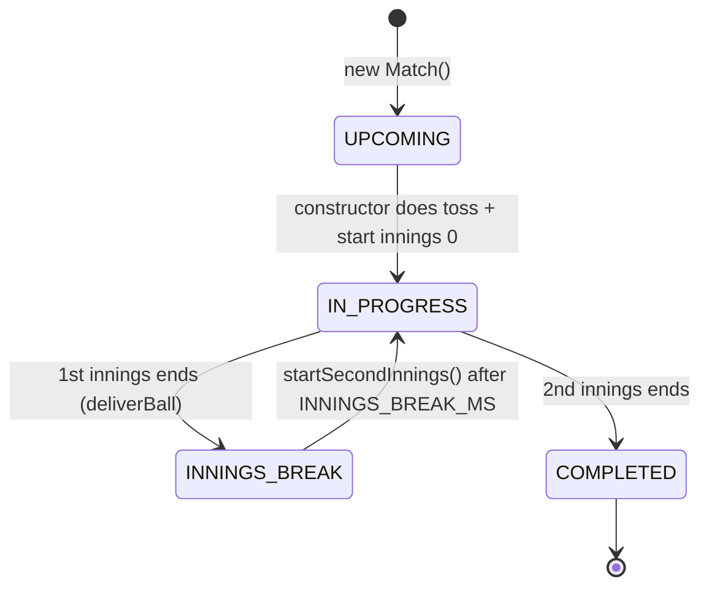
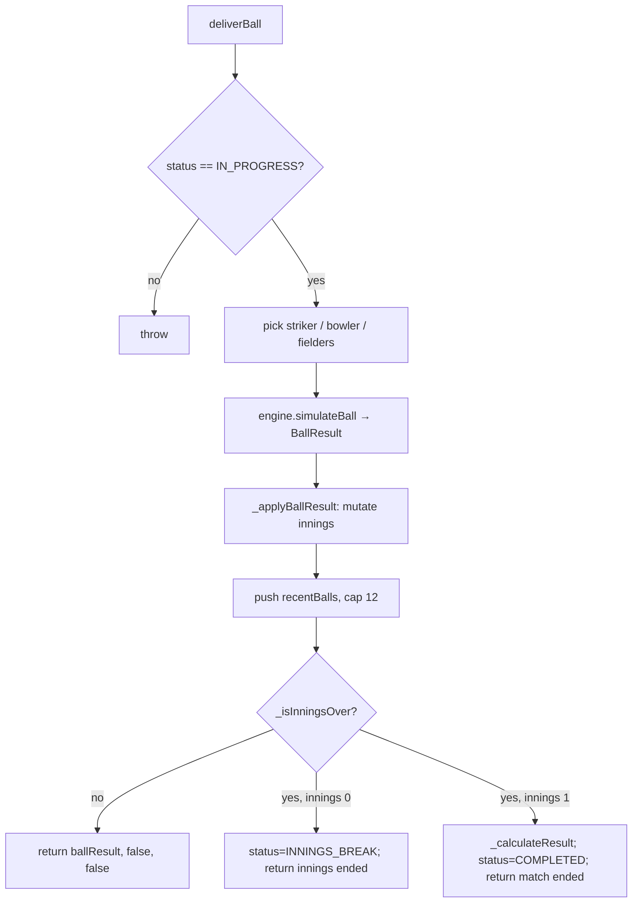
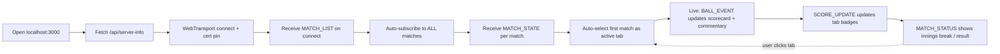

# Business Logic — Cricket Domain

The "business" here is **simulating realistic T20 cricket** and streaming it.
All domain logic lives in `server/cricket/` and is pure (no I/O).

## 1. Domain concepts

- **Match** — two innings between `team1` and `team2` at a `venue`. T20 = max 20
  overs / 10 wickets per innings.
- **Innings** — one team batting. Tracks runs, wickets, overs.ballsInOver,
  batting line-up stats, bowling line-up stats, extras, fall of wickets, over log.
- **Over** — 6 *legal* balls. Wides and no-balls do **not** count as legal balls
  (they're re-bowled) but still add runs/extras.
- **Outcomes** — `DOT, RUN_1, RUN_2, RUN_3, FOUR, SIX, WIDE, NO_BALL, WICKET`.
- **Dismissals** — `caught, bowled, lbw, run out, stumped` (weighted).
- **Roles** — `WK` (keeper), `BAT`, `AR` (all-rounder), `BOWL`. Only `BOWL`/`AR`
  appear in the bowling line-up.

## 2. Match lifecycle (state machine)



> Note: `UPCOMING` is set then immediately overwritten to `IN_PROGRESS` inside
> the constructor — matches are "live" the moment they're created.

### Innings-end conditions (`_isInningsOver`)
An innings ends when **any** is true:
1. `wickets >= 10`
2. `overs >= 20`
3. (2nd innings only) `runs >= target` — the chase is won

### Result calculation (`_calculateResult`)
- Chase succeeds (`inn2.runs >= target`) → batting team wins **by N wickets**
  (`10 - wickets`).
- Otherwise → team batting first wins **by N runs** (`inn1.runs - inn2.runs`),
  or **"Match tied!"** if margin is 0.

## 3. Core workflow: one ball delivery

`Match.deliverBall()` orchestrates each ball:



### What `_applyBallResult` updates per ball
- `inn.runs += result.runs + extraRuns`; bowler conceded runs.
- Extras: wides/no-balls accumulate in `inn.extras` (`total`, `wides`, `noBalls`).
- Striker stats: runs, balls (legal only), fours, sixes, strike rate. **Wides
  credit no ball/run to striker.**
- Ball symbol pushed to `currentOverBalls` (`0/1/2/3/4/6/W/Wd/NB`).
- **Wicket:** `wickets++`, striker marked out with dismissal text, bowler
  `wickets++`, fall-of-wickets entry, next batsman promoted to striker.
- **Strike rotation:** swap on odd runs; swap again at end of over.
- **End of over (`ballsInOver === 6`):** push `overLog` entry, bowler `overs++`
  + economy, reset over counters, swap strike, `_selectNextBowler`.
- **Run rate:** `runRate = runs / ballsBowled * 6`.
- **Chase (target set):** `requiredRunRate = runsNeeded / ballsLeft * 6`.

## 4. Probability model (the "algorithm")

`engine.simulateBall` draws an outcome via weighted random from `BASE_WEIGHTS`
(sum 100), tuned for ~7–9 runs/over and ~6–7 wickets/innings:

```
DOT 37 · RUN_1 23 · RUN_2 9 · RUN_3 2 · FOUR 13 · SIX 5 · WIDE 4 · NO_BALL 2 · WICKET 5
```

`situationalWeights(innings)` adjusts additively, then clamps to ≥0:

| Situation | Trigger | Adjustment |
|---|---|---|
| Death overs | `totalOvers >= 16` | SIX+4, FOUR+3, DOT+3, WICKET+2, RUN_1−6, RUN_2−6 |
| Powerplay | `totalOvers < 6` | FOUR+3, SIX+1, DOT−2 |
| Tail collapse | `wickets >= 7` | DOT+6, WICKET+4, SIX−4, FOUR−4 |
| Desperate chase | `target` set & `RRR > 12` | SIX+5, WICKET+4, DOT−4 |
| Easy chase | `target` set & `RRR < 6` | RUN_1+4, DOT−3, WICKET−2 |

> **Known discrepancy:** the comment says "Death overs (17–20)" but the code
> triggers at over **16**. Behaviour follows the code (≥16). See
> `change-impact-guide.md`.

Dismissal type is a second weighted draw: `caught 40, bowled 25, lbw 20, run out 10, stumped 5`.
`caught`/`run out` pick a random fielder; others have `fielder = null`.

## 5. Bowler selection rules (`_selectNextBowler`)
- Eligible = bowlers with `< 4` overs **and** not the bowler who bowled the
  previous over (`lastBowlerIdx`) — enforces "no consecutive overs."
- If none eligible, fall back to any bowler under 4 overs (relaxes the
  no-consecutive rule rather than stall).
- Choice is random among eligible.

## 6. Toss & innings assignment (`_doToss`, `_startInnings`)
- Toss winner random; decision `bat`/`field` random.
- Innings 0 batting team derived from toss; innings 1 teams swap.
- Batting order sorted by `battingPos`; first two batsmen marked `batting`.
- Bowling line-up = players with role `BOWL` or `AR`.
- 2nd innings `target = innings[0].runs + 1`.

## 7. User journey (browser)



## 8. Hidden assumptions / invariants (important!)
- **The server pushes the full scorecard on every ball** (`BALL_EVENT.scorecard`
  = `match.toJSON()`). The client is essentially stateless re: derivation — it
  replaces stored state wholesale. Cheap to reason about, wasteful on bandwidth.
- **Matches auto-replace (continuous).** When a match reaches `COMPLETED`, the
  result stays on screen for `POST_MATCH_BREAK_MS`, then `MatchManager._replaceMatch`
  swaps in a fresh matchup and pushes an updated `MATCH_LIST` to all sessions —
  the engine never goes idle.
- **No persistence.** A restart loses all in-progress matches and starts fresh
  random fixtures.
- **No free-hit logic** despite no-ball commentary mentioning it; the next ball
  is a normal delivery.
- **`MAX_CONCURRENT_MATCHES=4` but only 6 teams** ⇒ `getMatchups` can only make
  3 non-overlapping pairs, so **at most 3 matches run** (loop pairs `i, i+1`
  over 6 shuffled teams). The "4" is an upper bound that's never reached.
- **`team1`/`team2` shape differs by message:** strings in summaries
  (`MATCH_LIST`/`SCORE_UPDATE`), full objects in `MATCH_STATE`/`BALL_EVENT`.
  `store.getMatchList()` and `ui.js` normalise this.
