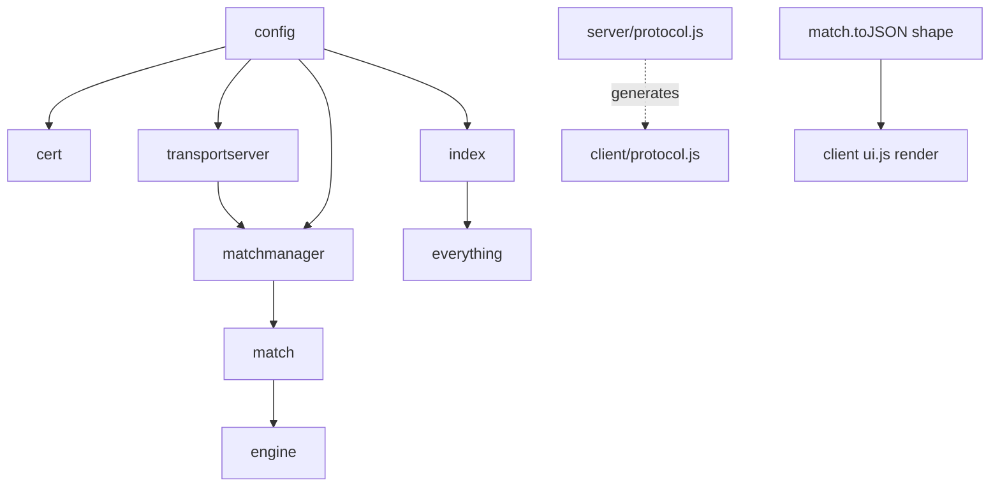

# Change Impact Guide

> "If I modify X, what else breaks?" Read this before editing.

## Highest-leverage / highest-risk files

| File | Blast radius | Why |
|---|---|---|
| `server/protocol.js` **+** `client/js/protocol.js` | Server ↔ browser contract | They are **two manual copies**. Editing one without the other silently breaks decoding. No test guards this. |
| `server/cricket/match.js` `toJSON()` | All client rendering | The scorecard object shape is consumed verbatim by `ui.js`. Renaming a field (e.g. `currentInnings`, `innings[].battingLine`) breaks the UI with no error. |
| `server/config.js` | Many imports | Renaming an export breaks `index.js`, `cert.js`, `transport-server.js`, `match-manager.js`, and both test scripts. |
| `server/transport-server.js` command `switch` | Client commands | This is the server-side API. Removing a case breaks the matching `_sendCommand` on the client. |
| `server/cert.js` | Whole connection | ECDSA-P256 + ≤14-day constraints are load-bearing; breaking them yields opaque `Opening handshake failed`. |

## Dependency chains

### "Touch A → re-check B"
- **Change `match.toJSON()` / innings shape** → re-check every `ui.js`
  `render*` and `store.js` `getMatchList()` (field names `team1.shortName`,
  `innings[i].battingLine/bowlingLine/extras/overLog/fallOfWickets`,
  `currentInnings`, `runRate`, `requiredRunRate`, `target`).
- **Change `MSG` constants/payloads** → edit `server/protocol.js` only (the
  client copy is generated — run `npm run gen:protocol` or just `npm start`) +
  `match-manager.js` emit sites + `transport-server.js` handlers + `app.js`
  dispatcher + `store.js` mutation + `ui.js`.
- **Change `SCORE_UPDATE` payload** → `store.applyScoreUpdate` (`_liveScore`)
  and tab badge rendering depend on `runs/wickets/overs/target`.
- **Change `BALL_INTERVAL_MS`** → affects RPO/wicket pacing only; safe.
- **Change `BASE_WEIGHTS` / `situationalWeights`** → only affects realism; pure,
  isolated, no downstream contract.
- **Add a team / change roles** → `_startInnings` filters bowling line-up by role
  `BOWL`/`AR`; a team with too few bowlers can stall `_selectNextBowler`.
- **Change cert algorithm/validity** → browser + Node clients all fail to
  connect; nothing else logs a clear cause.

## High-caution areas (subtle behaviour)

1. **`MATCH_LIST` bootstrap reliability — [RESOLVED 2026-06-21].** Now sent over
   a reliable unidirectional stream (was an unreliable datagram that, if dropped
   or oversized, left the **client never auto-subscribing** and the UI empty —
   the most likely "scores never appear" bug). Keep it on a reliable channel: it
   is the client's only first-connect subscribe trigger (the client never sends
   `GET_MATCHES` on its own).
2. **`_tick` is `async` on a fixed `setInterval`.** It does not await the
   previous tick. If broadcasting to many subscribers takes longer than
   `BALL_INTERVAL_MS`, ticks overlap. `deliverBall()`'s mutation runs
   synchronously before any `await`, so state stays consistent, but message
   *ordering* across overlapping ticks is not guaranteed under load.
3. **One new unidirectional stream per ball per subscriber** (`_sendViaStream`).
   Cost = `matches × subscribers` stream creations every 4s. Fine for a demo;
   a real fan-out needs reuse/batching (see ai-context risks).
4. **Completed matches linger in `matches` map forever** (timer cleared, object
   retained). No new matches are created → the engine goes idle. Any "keep it
   running" feature must add a scheduler.
5. **Death-overs threshold mismatch:** code triggers at `totalOvers >= 16`,
   comment says 17–20. Decide intent before "fixing" — changing it alters match
   realism and any tuning done against current behaviour.
6. **No-ball + wicket:** `_applyBallResult` guards `isWicket && !isNoBall`, but a
   `WICKET` outcome and `NO_BALL` outcome are mutually exclusive in the engine,
   so `!isNoBall` is always true (dead condition). Harmless but misleading.
7. **Reconnect re-subscribe** loops `_subscriptions` after opening a fresh bidi
   stream. If you change connect ordering in `_attemptConnect`, ensure the
   command writer exists before the re-subscribe loop runs.
8. **Strike rotation** swaps on odd `result.runs` and again at over end. Editing
   either site can double-swap or desync striker/non-striker.

## Things that are safe to change in isolation
- `engine.js` weights, commentary templates, dismissal weights.
- `teams.js` names/colours/venues (keep structure + 11 players + ≥4 bowlers/ARs).
- `config.js` timing values (`BALL_INTERVAL_MS`, `INNINGS_BREAK_MS`).
- `ui.js` markup/CSS classes (as long as `index.html` element IDs still exist:
  `#scorecard`, `#match-tabs`, `#commentary-feed`, `#fall-of-wickets`,
  `#fow-heading`, `#connection-status`, `#wt-unsupported`, `#app`).

## Test/verification touch points
- `test/verify-cert.js` and `test/wt-client.js` both import from
  `server/config.js` and `server/protocol.js` — they break alongside those.
- After any code change run `graphify update .` (per repo `CLAUDE.md`) to keep
  the knowledge graph current.
