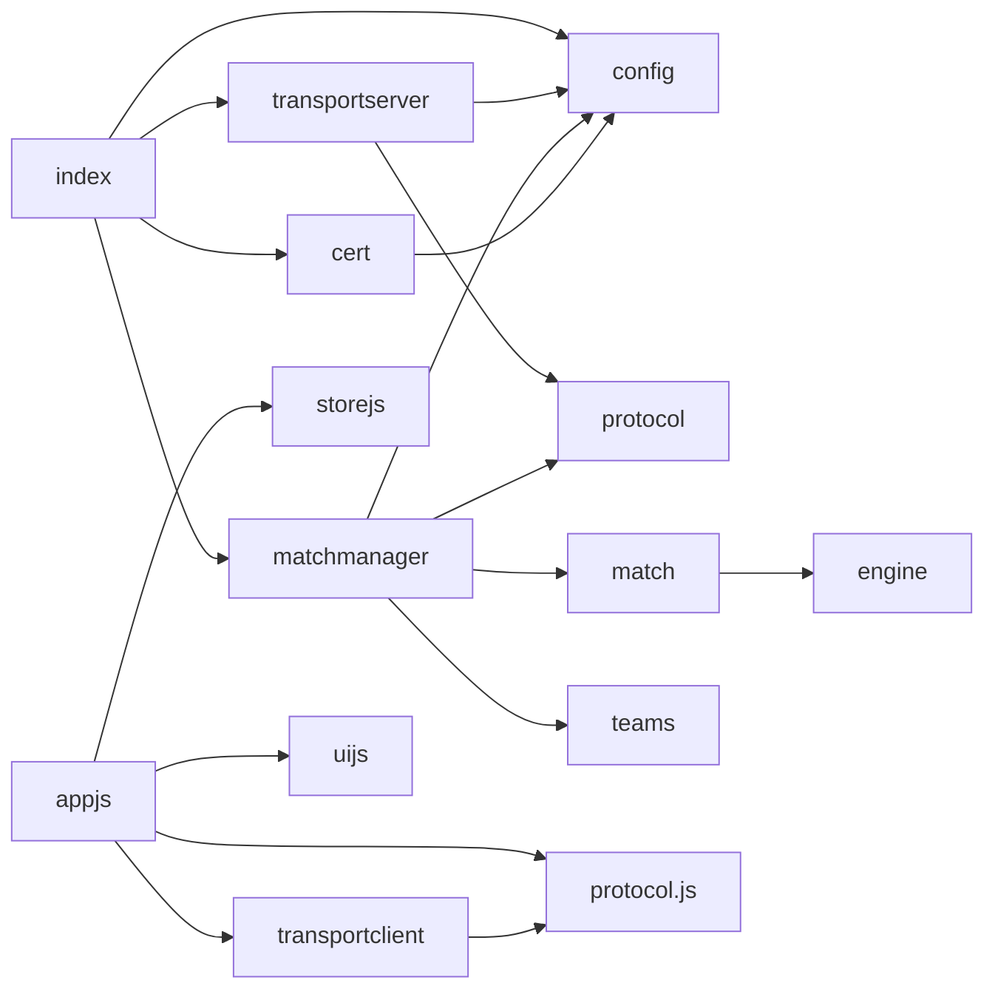

# Codebase Map

## Folder structure

```
Web-Transport/
├── package.json            # ESM, scripts: gen:protocol / start / dev (nodemon)
├── README.md               # Quick start + WT channel overview
├── ARCHITECTURE.md         # Long-form file map + debug playbook (pre-existing)
├── .devcontainer/          # Node 22 Debian container; installs openssl + lsof
├── .vscode/                # launch.json (Start Server / Test Client / Verify Cert), tasks.json
├── docs/                   # ← this documentation set
├── server/                 # All backend code (entry: server/index.js)
│   ├── index.js
│   ├── config.js
│   ├── cert.js
│   ├── protocol.js
│   ├── transport-server.js
│   ├── match-manager.js
│   └── cricket/
│       ├── engine.js
│       ├── match.js
│       └── teams.js
├── client/                 # Browser app (served statically, no runtime deps)
│   ├── index.html
│   ├── css/style.css
│   └── js/
│       ├── protocol.js     # GENERATED from server/protocol.js — do not hand-edit
│       ├── transport-client.js
│       ├── store.js
│       ├── ui.js
│       └── app.js
├── scripts/
│   └── gen-client-protocol.mjs  # generates client/js/protocol.js from server/protocol.js
└── test/
    ├── wt-client.js        # Node WebTransport client (terminal ball-by-ball)
    └── verify-cert.js      # Cert fingerprint + connection diagnostic
```

## Server files

### `server/index.js` — Entry point / bootstrap
- **Purpose:** orchestrates startup in strict sequential order.
- **Flow:** `getOrCreateCert()` → `new MatchManager().start()` → `await createTransportServer(cert,key,manager)` → `express` app `listen(3000)`.
- **Endpoints:** `/api/server-info`, `/api/health`. Static serving of `../client`.
- **Also:** `EADDRINUSE` handling, `SIGINT`/`SIGTERM` → `shutdown()` → `manager.stop()`.
- **Depends on:** cert.js, match-manager.js, transport-server.js, config.js, express.
- **Breaks if modified:** startup ordering is load-bearing — `createTransportServer` must be awaited (waits on `quicheLoaded`) before the app is "ready."

### `server/config.js` — Central constants
- `WEBTRANSPORT_PORT=4433`, `HTTP_PORT=3000`, `WEBTRANSPORT_PATH='/cricket'`.
- `BALL_INTERVAL_MS=4000`, `INNINGS_BREAK_MS=10000`, `MAX_CONCURRENT_MATCHES=4`.
- `CERT_VALIDITY_DAYS=14`, `CERT_CACHE_PATH='/tmp/cricket-wt-cert.json'`, `MAX_CHUNK_BYTES=65536`.
- **Note (Windows):** `/tmp/...` cache path is POSIX; on Windows it resolves relative to the current drive root. Cert generation also shells out to `openssl` with `2>/dev/null`, which assumes a POSIX-ish shell.
- **Imported by:** nearly everything. Changing names breaks many imports.

### `server/cert.js` — TLS certificate
- `getOrCreateCert()` → `{ cert, key, fingerprint: Buffer(32) }`.
- Caches to `CERT_CACHE_PATH`; reuses if >1 day remaining.
- Generates via two `openssl` calls: `genpkey EC P-256` then `req -new -x509 -days 14` with SAN + `CA:false`.
- `computeFingerprint(pem)` → strips PEM headers, base64-decode → DER → SHA-256.
- **Constraints:** **must** be ECDSA P-256 (quiche rejects RSA); **must** be ≤14 days.
- **External dependency:** OpenSSL binary on PATH.

### `server/protocol.js` — Wire protocol (server copy)
- `MSG` constants (see below), `encode(type,payload)` → Uint8Array of `{type,payload,ts}`, `decode(bytes)` → object.
- **Generated** to `client/js/protocol.js` by `scripts/gen-client-protocol.mjs` (do not hand-edit).

### `server/transport-server.js` — WebTransport server
- `createTransportServer(cert,key,manager)`: `await quicheLoaded`, `new Http3Server({port,host:'0.0.0.0',secret,cert,privKey})`, `startServer()`, then `_acceptSessionsLoop`.
- `_handleSession`: await `session.ready` → send `MATCH_LIST` over a reliable unidirectional stream → `_readCommandStreams` → await `session.closed` → `manager.removeSession`.
- `_handleCommandStream`: reads bidi chunks, rejects `> MAX_CHUNK_BYTES`, decodes JSON, dispatches `SUBSCRIBE`/`UNSUBSCRIBE`/`GET_MATCHES`, replies `MATCH_STATE`/`MATCH_LIST`/`ERROR`.
- **Depends on:** protocol.js, config.js, the WT library, and the `manager` interface.
- **Breaks if modified:** the command stream's `switch` is the server-side API surface.

### `server/match-manager.js` — Orchestration + broadcast
- State: `matches: Map<id,Match>`, `subscribers: Map<id,Set<session>>`, `timers: Map<id,Timeout>`, `sessions: Set<session>` (all connected clients).
- `start()` → `getMatchups(4)` → create `Match` + ticker per match.
- `_tick(matchId)` (async, runs on `setInterval`): stops timer if COMPLETED, skips if INNINGS_BREAK, else `match.deliverBall()` then broadcasts. On match end, schedules `_replaceMatch` after `POST_MATCH_BREAK_MS`.
- `_replaceMatch(oldId)` — removes the finished match, spins up a fresh `getMatchups(1)` match + ticker, then `_broadcastMatchListToAll()` so clients reconcile (continuous play).
- Broadcast helpers: `_broadcastStream` (one **new** unidirectional stream per session via `_sendViaStream`), `_broadcastDatagram` (per-session datagram writer), `_broadcastMatchListToAll` (MATCH_LIST to every session).
- `addSession`/`removeSession` track the global `sessions` set; `subscribe` returns `match.toJSON()`; `removeSession` also drops the session from every match's subscriber set.
- **Depends on:** Match, teams, protocol, config, and live WT session objects.

### `server/cricket/engine.js` — Ball simulator (pure, stateless)
- `simulateBall(innings, batsman, bowler, fielders)` → `BallResult`.
- `BASE_WEIGHTS` (sum 100) + `situationalWeights()` adjustments (death overs, powerplay, low wickets, chase RRR).
- `weightedRandom()`, `DISMISSAL_WEIGHTS`, `COMMENTARY_TEMPLATES` (functions per event), `generateCommentary`, `pickRandom`.
- **No I/O, no state.** Safe to unit test directly.

### `server/cricket/match.js` — T20 state machine
- `class Match` — lifecycle `UPCOMING → IN_PROGRESS → INNINGS_BREAK → IN_PROGRESS → COMPLETED`.
- `deliverBall()` (delegates *what happened* to engine, owns all bookkeeping), `startSecondInnings()`, `toJSON()` (full), `toSummary()` (brief).
- Private: `_doToss`, `_startInnings`, `_applyBallResult` (runs/wickets/extras/over/strike-rotation/stats), `_isInningsOver`, `_selectNextBowler` (≤4 overs/bowler, no back-to-back), `_calculateResult`.
- Constants: `MAX_OVERS=20`, `MAX_WICKETS=10`, `MAX_BOWLER_OVERS=4`.
- **Breaks if modified:** scorecard shape here is consumed verbatim by client `ui.js`.

### `server/cricket/teams.js` — Static data
- 6 IPL-inspired teams × 11 players (roles WK/BAT/AR/BOWL, `battingPos`), 6 venues.
- `getMatchups(count)` — shuffles teams, pairs them, **deep-clones** (`JSON.parse(JSON.stringify)`) so each match has independent mutable player objects.

## Client files (loaded in this order by `index.html`)

1. **`protocol.js`** — **generated** from `server/protocol.js` by `scripts/gen-client-protocol.mjs` (do not hand-edit): `MSG`, `encode`, `decode`. Globals (no modules).
2. **`store.js`** — `CricketStore`: `_matches: Map`, `_matchList`, `_activeMatchId`, `_connectionStatus`; mutations (`setMatchList`, `setMatchState`, `applyBallEvent`, `applyScoreUpdate`, `applyMatchStatus`, `setActiveMatch`); observer `on/off/_emit`. `getMatchList()` derives fresh summaries from `_matches`.
3. **`transport-client.js`** — `CricketTransportClient`: `connect`, `subscribe`, reconnect w/ exponential backoff, readers for unidirectional streams / bidi replies / datagrams, `_consumeStream` reassembly, `_hexToUint8Array`.
4. **`ui.js`** — pure render functions: `renderConnectionStatus`, `renderMatchTabs`, `renderScorecard`, `renderBattingTable`, `renderBowlingTable`, `renderOverLog`, `renderRecentBallsHtml`, `addCommentary`, `renderFallOfWickets`, `escapeHtml`.
5. **`app.js`** — wires transport → store → UI. Central `transport.on('message')` dispatcher; exposes `window._store` / `window._wt`. Browser-support guard. Auto-subscribes to every match in `MATCH_LIST`.

`index.html` also has an inline theme toggle (dark/light, `localStorage` key `cricket-theme`).

## Message types (`MSG`)

| Constant | Direction | Channel | Payload |
|---|---|---|---|
| `MATCH_LIST` | S→C | unidirectional stream (on connect) / bidi (GET_MATCHES) | `{ matches: [summary] }` |
| `MATCH_STATE` | S→C | bidi reply | full `match.toJSON()` |
| `BALL_EVENT` | S→C | unidirectional stream | `{ matchId, ball, scorecard }` |
| `SCORE_UPDATE` | S→C | datagram | `{ matchId, team1, team2, runs, wickets, overs, target }` |
| `MATCH_STATUS` | S→C | unidirectional stream | `{ matchId, status, ... }` |
| `ERROR` | S→C | bidi reply | `{ message }` |
| `SUBSCRIBE` | C→S | bidi | `{ matchId }` |
| `UNSUBSCRIBE` | C→S | bidi | `{ matchId }` |
| `GET_MATCHES` | C→S | bidi | `{}` |

## Dependency relationships



External: `express`, `@fails-components/webtransport`, `uuid`, OpenSSL CLI.
**Listed-but-unused:** `selfsigned` (RSA-only; the project switched to OpenSSL ECDSA).
